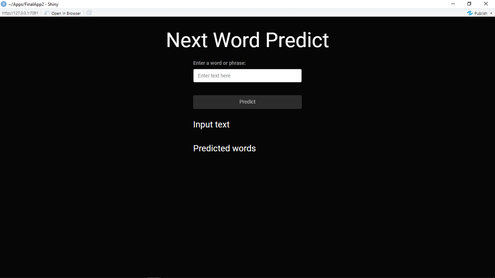

Next Word Predict
========================================================
author: Jatin chawda
date: 14/04/20
autosize: true

Introduction
========================================================

The goal of the Data Science Capstone Project was to use the skills acquired in the specialization in creating an application based on a predictive model for text.

Given a word or phrase as input, the application tried to predict the next word. The predictive model is trained using a corpus, a collection of written texts, called the HC Corpora which has been filtered by language.

We have created a predictive text model using a large text corpus as training data, in order to be able to predict subsequent words given some text. Through this we have build a Shiny application.

About the App
========================================================

The Word Prediction application provides next word suggestions given an input phrase. 

It was developed for the Capstone Project for the Data Science Specialization by Johns Hopkins University in Coursera and is accessible through the bleow link:

- <https://jatin1503.shinyapps.io/NextTextPredict/>

The r codes for the application are available in the github repository:

- <https://github.com/jatinchawda1503/Data-Science-Capstone-Project-Jhon-Hopkins-University>

About the App
========================================================

 

How It Works
========================================================

- Next Word Predict is a Shiny application that utilizes a book forecast calculation to foresee the following word(s) in light of content entered by a client. 

- The application will propose the following word in a sentence utilizing a n-gram calculation. A n-gram is a coterminous grouping of *n* words from a given arrangement of content. 

- The content used to manufacture the prescient content model originated from a enormous corpus of online journals, news and twitter information. N-grams were separated from the corpus and afterward used to assemble the prescient content model. 

How It Works
========================================================

- Different strategies were investigated to improve speed and precision utilizing characteristic language handling and content mining strategies.

How It Works
========================================================

- The predictive text model was built from a sample of 800,000 lines extracted from the large corpus of blogs,news and twitter data.

- The sample data was then tokenized and cleaned using the **tm** package and a number of regular expressions using the **gsub** function. As part of the cleaning process the data was converted to
lowercase, removed all non-ascii characters, URLs,email addresses, Twitter handles, hash tags, ordinal numbers,profane words, punctuation and whitespace. The data was then split into tokens (n-grams).

How It Works
========================================================

- Summary of Clean-up steps:

1. Changing text to lowercase
2. Removing non-ASCII characters
3. Removing punctuation and symbols (i.e. #, etc.)
4. Removing numbers
5. Removing sentences with words in the profanity list

- As text is entered by the user, the algorithm iterates from longest n-gram (4-gram) to shortest (2-gram) to detect a match. The predicted next word is considered using the longest, most frequent matching n-gram. The algorithm makes use of a simple back-off strategy.
